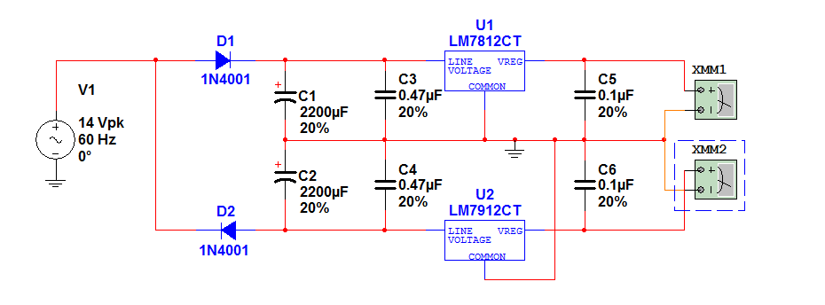
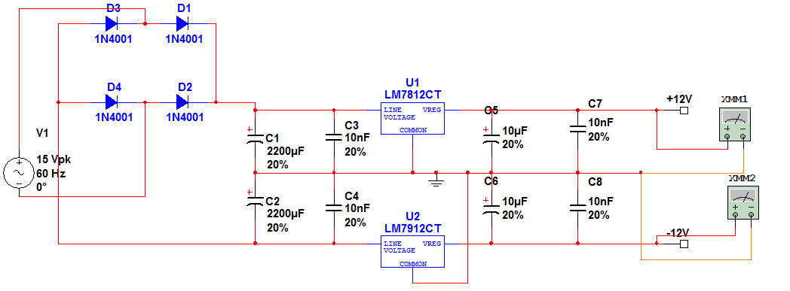
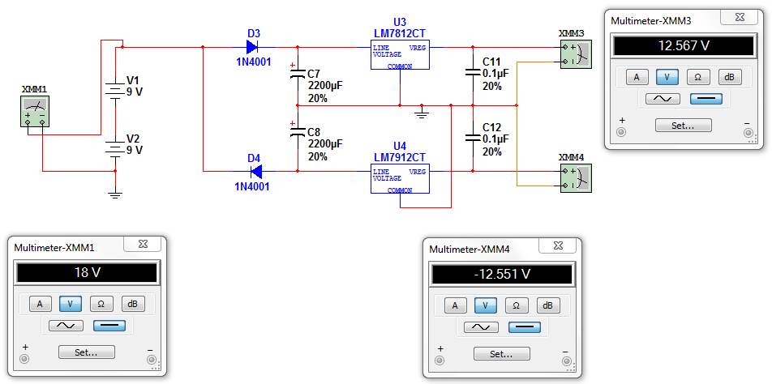

#MOTIVATION & DISCUSSION
Examining the use of ephemeral interaction with technology, our senior design group decided to tie together the theremin, a musical instrument that can be played without touch, to create a technological interaction that took physical bodies as input via the ephemeral, and provide a highly customizable interaction environment. To tie together this highly adaptable environment we lit upon Hochenbaum's case study on the Chronome[1][1] that notes to provide a virtuosic experience without the years of mastery, one must find a balance between the complexity of an instrument and ease of use. Having found this highly pertinent to our endeavor we decided to use this as the hub of interaction between the MIDI-capable theremin and any other MIDI-capable performance instrument. We set to make each device modular, to expand upon this customizability, in that they can be placed together in many number of combinations to reflect one's personal mental organization. By creating the Expandome we wanted to even further push the easy-grid instrument to the next level. The theremin, as an infinitely variable instrument, that requires years of practice as well as a near perfect pitch ear to master, is an ideal candidate for our intermediary device, a pitch-to-MIDI converter. This device can take any analog instrument and allow pitch-mapping, and arpeggiated control, as well as direct feedback for practice. This complements our theme of ease-in-interaction in proficient playing, as well as gives any analog instrument social and adaptable input to our performance device hub.

[1]: http://flipmu.com/files/2011/07/2011_ACMC_Chronome.pdf "The Chronome: A Case Study in Designing New Continuously Expressive Musical Instruments Vallis, O., Hochenbaum, J., Murphy, J., Kapur, A., Proceedings of the Australasian Computer Music Conference (ACMC). 2011. Auckland, New Zealand."

#OBJECTIVES
Our final goal is to create a virtuosic experience through high customizability, modularity, and simplicity. We shall accomplish this by understanding and developing the following devices: a theremin, a pitch-to-MIDI converter, and at least three Expandome.

Another set of goals revolves around a theme of learning through direct feedback. A virtual instrument interface will be created that provides the user with all the tools to directly control the devices, as well as provide real-time data on the operation of the units. For example, the theremin will be supplemented with a pitch training subprogram. It will provide a novice thereminist immediate pitch and note display on a concert pitch scale.

#DEFINITION
##uWave Theremin 
Patented in 1928[2][2], the theremin was the first electronic musical instrument. Although now a classic example, it has always been the most drastic break from any traditional instrument before or since. The theremin is played by moving both hands in the air in the vicinity of two antennas. The player's hands creates a 'hand capacitance' between the antenna and true ground through one's hand, acting as a plate, and the antenna as the other plate. Typically, the left hand controls the volume, and the right hand the pitch. For the purpose of this project we will call our implementation of this device the uWave Theremin. The theremin requires an exquisite ear and complete control of one's motion; this brings us to our second device, a pitch-to-MIDI converter.

[2]: http://www.google.com/patents/US1661058 "U.S. Patent US1661058"

##SenseBox - A Pitch-to-MIDI Converter 
This device takes an incoming audio signal and converts it to MIDI data messages. The audio signal is analyzed by comparing its frequency to a lookup table of musical scale note pitches. The incoming audio signal can be directly pitch-matched in the outgoing MIDI data or used as a controller via data messages. By allowing the infinitely fluid theremin to be mapped to data messages, we will be able to directly see how in-tune the player is. This is useful as direct training feedback. It also allows the theremin to not only be an instrument but dually gives it the capability of a MIDI controller. In the latter faculty, it will be able to control any virtual instruments. In both capacities it will be able to be either an input source, or supplemental controller with our next device, the Expandome.

##Expandome 
Hochenbaum et al. ported the Monome[3][3] to the Arduino platform with the Arduinome[4][4]. They additionally expanded upon this ideally simplistic, yet complex musical tool with the aim at creating an instrument that could elicit a virtuosic experience with ease. The Monome and its ported version are both very minimalist grid devices that are not actually instruments, but controllers. Upon pushing a button, the information is sent via shift registers to the computer, which being controlled by one of the various programs (described below), then tells it what to do. These MIDI-capable programs can begin tracks, set beat-counts, produce direct noise, and be used as anything really imaginable as an input including an alternative game controller pad, keyboard or spectrum visualizer.

[3]: http://monome.org/ "see http://monome.org/"
[4]: http://flipmu.com/work/arduinome/ "see http://flipmu.com/work/arduinome/"

The Expandome is an iterative development[5][5] on the Arduinome, as was the Chronome on the Arduinome to further this easy-grid concept. It is an effort to add to this highly customizable environment by allowing multiple users to interact together and provide a fluid setup that reflects the user's personal performance organization style. It is a highly adaptable MIDI controller implementing a backlit push-button grid. This will be accomplished by allowing each device to work standalone, or pushed together with another device. The devices will be in three grid forms, an 8x8, 4x8, and 4x4 and each device will have internal storage to save setups and beats, so as not to always rely on computers, and dually be able to aid in spontaneous interaction with other performers.

[5]: http://mtiid.calarts.edu/sites/default/files/publications/2010_nime_interfaces.pdf "A Shift Towards Iterative and Open-Source Design for Musical Interfaces Kapur, A., Darling, M., Murphy, J., Hochenbaum, J., Diakopoulos, D. Proceedings of the 2011 International Conference on New Interfaces for Musical Expression. June 2010. Sydney, Australia."

#SPECIFICATIONS 
##uWave Theremin
The device will meet the following requirements:

*	It shall operate with the supply voltage of $\pm$12v.
*	Operate with one toggle switch to turn on or off the device.
*	Two coil antennas will be mounted (pitch and volume).
*	It shall transmit analog signals to the SenseBox.
*	Four potentiometers will be included to control the volume, pitch, brightness and waveform of the uWave Theremin.
*	Dimension of cabinet.
*	It shall have two output jack) - audio and pitch preview.
*	Resonant pitch antenna frequency will be 260 kHz
*	Resonant volume antenna frequency will be 450 kHz.
*	Output frequencies will range from 0 to 3 kHz.
*	This device shall be operated with minimal electro-magnetic interference EMI.

##SenseBox 
The device will meet the following requirements: 

*	It shall operate with the supply voltage of 5V.
*	Have one set of  MIDI sockets - MIDI IN and MIDI OUT (no MIDI THRU).
*	It shall receive analog signals from uWave Theremin and convert it to MIDI data. The MIDI data will include, but not limited to: MIDI note number, NOTE ON, NOTE OFF, Velocity, and Control Mode/Change. 
*	It shall transmit MIDI data out to another MIDI device or DAW.
*	It shall receive MIDI data from another MIDI device and store it.
*	Dimension - not less than 6" wide x 6" long x 5" high.
*	It shall operate only if the incoming voltage from the uWave is 0.8V RMS.
*	It shall be capable of running standalone with all primary functions on the ATmega microprocessor.
*	It shall corporate with the uWave Theremin using two input audio jacks & pitch preview.
*	It will include one LCD screen panel. The LCD will display but not limited to: current mode operation, note name based on the current pitch, volume value, incoming MIDI note number from a MIDI device.
*	Operate toggle rotary switch for choosing the mode operation in the SenseBox.
*	Contain five LEDs to display the accuracy of the desired pitch from the uWave Theremin.
*	Contain three LEDs to display the intensity of the volume that is emitting from the uWave Theremin.

##Expandome 
Each device will comes in an 8x8, 4x8, or 4x4 form. Excluding those related grid and enclosure differences, the requirements and specifications below are equivalent between each device unless otherwise noted.

The device will meet the following requirements: 

*	It shall have an $n x m$ backlit push-button grid. It will be the primary interaction with the Expandome.
-	The backlit grid will have the capability of having the appearance of being fully lit due to rapidly multiplexing each row. 
-	The device shall be given maximum responsiveness towards multiple button presses.
-	There will be minimum delay in noise responsiveness, between pushing a button and immediate data and noise reply.
*	It is capable of running standalone with all primary functions on the ATmega microprocessor.
-	Default programs on microprocessor will allow the Expandome to perform without any virtual instrument programs.
*	Implement an SD Card Reader with default beats and beat structure. Default programs associated with other devices as well as saved data messages will be retained on this expandable drive.
*	Be capable of general device recognition and interacting, via MIDI and USB, with any typical computer virtual instrument program.
*	Works as, or with, any other typical MIDI instrument.
*	Draw 5V max and have a maximum cascading current draw of 500mA for up to three devices.
-	Current draw for each row is set with the Rset resistor. Two resistances will be chosen, one for maximum brightness, and a second for lower power consumption by minimalizing the current draw.
*	Run on batteries when unplugged from a power source.
-	No interruptions shall occur, if devices are working in their standalone capacity.
-	This shall aid in power cascade.
*	Have two sets of MIDI sockets in/out for 4x4 and 4x8, four for 8x8 devices.
*	Act as the primary Expandome device if an 8x8. 
-	If two 8x8 devices are connected, the device connected directly to a computer shall be given higher control.
*	Perform in an expanded capacity when two or more Expandome are connected, in that they shall perform as one.
*	Connect flush with all other instruments from this project.

#RESEARCH
##Theremin 
Our search for a uWave Theremin design that would serve as a good reference brought us to a few different kinds of representation of the device.  Research for different kinds of theremin devices was done on the web at thereminworld.com.  Some theremin designs that the group came across included the vacuum tube theremin also known as the RCA theremin, digital theremin (digital components using transistors and logic gates) and analog theremin (active and passive components).  Also, there were some simplified theremin designs that only utilized a pitch antenna and omitted the volume antenna, but the group has decided that a small and compact theremin with all its components available would be more flexible to work with when it came time to experiment with more functionality.  Some qualities of the theremin designs listed above will be investigated in this portion of the paper, but because the device as a whole will be modular, the group has decided to base most of the theremin portion to Robert Moog's design seen in his DIY paper.  Also, Moog's design was chosen because of his impact in the world of electronic music and his efforts on the synthesizer.

As research on all the different variations of the theremin continued it was noticed that they all had something in common with each other.  They were all composed of three main blocks - each capable of producing an output and taking in inputs.  These blocks include the antenna circuitry, the beat oscillator, and the volume controllers, which can be seen in more detail in our block diagram below.  For our research we focused on these three parts individually to understand how the theremin works. In essence, it gave us an idea of what to expect during design and testing, which will be discussed later.

###Antennas 
The uWave Theremin utilizes two antennas.  Though the term "antenna" will be used, it should be noted that these aren't regular antennas but they are only one plate of a capacitor connected to a circuitry to create a capacitance sensor[6][6]. As mentioned in the project definition, one antenna will be used for controlling pitch and the other will be used to control volume, or the amplitude of the pitch frequency.  In this section we will look at a few antennas made of different materials and see their effects.  We will also investigate the pitch and volume antennas and see how their capacitance affects their respective circuits and the uWave Theremin as a whole.

[6]: http://thereminworld.com/User/Details/FredM "See Fred Mundell's comments on Theremin World"

####Antenna Material Considerations 
There are a few different materials that we can consider when designing the pitch and volume antennas; solid brass, brass tube, aluminum, solid copper and copper tube. 

A 7/16 inch diameter solid brass or brass tube was noted by one experimenter that they both work equally well. It is necessary to adjust the capacitance of the variable pitch oscillator to get the best performance with each type of antenna. The brass tubing is hard to bend without the purchase and use of special bending equipment. Aluminum is a better option for an antenna because it is flexible. 

The uWave Theremin antennas are not like the usual antennas which are designed based on wavelength and polarization factors. As mentioned earlier, the uWave Theremin antennas are designed to behave as one plate of a capacitor, while your hand acts as the other plate. The surface area and length are the important factors in the design of the uWave Theremin antennas (this statement will become apparent in a few moments). Also, the electrical resistance of the antenna may be an important factor since it may add an unwanted attenuation factor. For this reason, we decided to eliminate the possibility of using aluminum in our design since the resistivity in copper is greater. As the inductive reactance increases, so should the linearity of the pitch antenna.

####Pitch Antenna 
Before we begin, it should be noted that most of the equations that will be presented in this section also applies to the volume antenna.  In theremin playing, the pitch antenna is responsible for varying the pitch or frequency of the sound produced by the device.  It is operated by placing the hand near the antenna thus changing the total capacitance seen by the pitch antenna circuit.  The antenna capacitance equation[7][7] is used to illustrate this:

[7]: http://ajp.aapt.org/resource/1/ajpias/v66/i11/p945_s1 "Physics of the Theremin Skeldon, K., Reid, L., McInally, V., Dougan, B., Fulton, C., Am. J. Phys. Vol. 66, No. 11, November 1998."

Equation 1: $C_A(\infty )=\frac{2\pi\epsilon_0h}{log(\frac{2h}{d})-k}$
 
where $C_A$ is the antenna's capacitance, $h$ and $d$ are height and diameter of the antenna respectively, $\epsilon_0$ is the permittivity of free space ($8.85 x 10^{-12}Fm^{-12}$), and $k$ is a constant depending on how far above the ground the antenna is mounted, which is about 0.4 for an antenna mounted almost at ground level[7][7].  The permittivity of free space, $\epsilon_0$, gives a hint that the capacitance of the antennas will be affected by characteristics like humidity. 

Equation 1 is the antenna's capacitance seen when the players hand is far away from the antenna; this equation also applies for the volume antenna.  Using Equation 1 and an antenna with $h$ = 0.45m (18 in) and $d$ = 0.0095 m (3/8 in) and $k$ being 0.4 we get $C_A$ to be approximately 15.87 pF.  The change in antenna capacitance when the players hand is in proximity is given by the following equation:

Equation 2: $\Delta C_A\approx\frac{\pi\epsilon_0h}{10log(\frac{4x}{d})}$

Where $x$ is the players hand distance from the antenna (it is assumed that this distance is greater than $d$)[7][7].  So, according to Equation 2, if a players hand is 4 m away from the antenna, a change in capacitance of only 0.43 pF is introduced to the antenna circuitry.  As the player puts his hands close to the pitch antenna, the pitch frequency increases and as the player puts his hand away from the antenna, the pitch frequency decreases.  The pitch antenna will be vertically placed on the right hand side of the uWave Theremin as this configuration is more sensitive to the players hand far away from it, and less sensitive when the players hand is close by[8][8]. 

[8]: www.cs.nmsu.edu/~rth/EMTheremin.pdf "Build the EM Theremin Moog, R., Electronic Musician, pg. 86-100, Feb., 1996"

Since the antenna is to be straight, a sufficient method for straightening it without leaving any kinks has to be considered.  If the antenna isn't purchased straight, then the antenna can be easily straightened by hand or by using a tube bender on it slowly and gently.  The pitch antenna of choice will be eighteen inches long and 3/8 in diameter.  This dimension is chosen because it gives the uWave Theremin a compact look to it.  Although the length was chosen for aesthetic reasons, the length of the antenna will have an indirect effect on the hand-to-antenna capacitance by not only affecting the antennas capacitance, but also the hand-to-antenna range as demonstrated in equation 2[9][9].  This will be important as it has an effect on the pitch antenna's reactance and the total impedance of the pitch circuit.  Because of its relatively short length, it was cascaded with multiple inductors to form a resonant frequency of 260 kHz[8][8].  This frequency was chosen in order to reduce interference from other devices in the vicinity of the uWave Theremin.  Since hand to antenna capacitance can vary on the order of 1pF to 15pF, the impedance of the pitch antenna circuit is drastically altered when the user brings his/her hand in proximity of the pitch antenna.  The equivalent circuit of the antennas can be seen in Figure 2.

[9]: http://www.gaudi.ch/OpenTheremin/ "Gaudi. Urs Gaudenz. 27 June, 2011. Creative Commons Attribution-NonCommercial-ShareAlike 2.5 Switzerland License."

####Volume Antenna
The volume antenna is quite similar to the pitch antenna.  It is responsible for varying the amplification of the audio signal.  It is operated in the same fashion as the pitch antenna.  As seen in [Figure 2], while the user moves his/her hand about the antenna, the total capacitance is altered, which in turn alters the impedance of the volume antenna circuitry.  In general, when the players hand is away from the volume antenna, the volume amplification factor is increased and when the hand is close to the antenna, the volume amplification is decreased.  According to the design seen in Robert Moog's paper, the volume antenna will be mounted horizontally on the left.  Mounting the pitch antenna in a vertical manner on the right hand side and the volume antenna in a horizontal manner on the left makes sure that the two antennas are perpendicular to each other.  This configuration is standard for most two antenna theremin devices as it minimizes the interaction between the two antennas and makes playing the theremin a little more intuitive as it is easier to grab and hold the volume antenna without having to lift your arm in order to mute the theremin[8][8].

Some of the theremin devices researched had both the pitch and volume antennas straight.  Some didn't even use metal tubes for the antennas, instead a metal sheet was used.  However, for the purpose of this project the pitch antenna of interest will be a vertical tube antenna.  The volume antenna will be similar to the curvy look seen in Robert Moog's paper.  The reason for this is because it'll give the device a more compact look and still maintain the device's historic design. 

In order to bend the volume antenna, a tube bender can be used or it can be bent by hand gently and slowly.  Though the soft copper tube is easy to bend by hand, one big disadvantage is that unwanted kinks can be left after bending is complete[7][7].  One tube bending method performed by traditional trombone craftsmen was to pour soapy water in the tube before bending. On some theremin forums visited[10][10], it was mentioned that the antenna can be stiffened by putting fine sand in it prior to bending.  In Moog's paper, he suggests putting stiffening resin in post-bending to reduce unwanted kinks.  The total length of the bent volume antenna will be around nine inches.  The volume antenna will be cascaded in series with inductors to create a resonant frequency of about 450 kHz.  The effects of the players hand on the volume antenna are similar to that of the pitch in the sense that the impedance of the volume antenna circuit is altered by the presence of the hand.

###Oscillators
Essentially, "the basic principle of the theremin is the heterodyne oscillator".[9][9]  "An heterodyne oscillator is a radio signal technique in which new frequencies are created by combining or mixing two frequencies".[11][11]  Therefore, in order to create the pitch or sound we can hear, the uWave Theremin will be composed of multiple oscillators set to oscillate at two distinct frequencies.  These two frequencies are slightly close to the resonant frequencies of the pitch and volume antenna circuits.  As seen from the block diagram [above] there will be three oscillators associated with the uWave Theremin.  These oscillators are the fixed pitch oscillator (FPO), the variable pitch oscillator (VPO) and the voltage oscillator.  The voltage oscillator will oscillate at a frequency of 450 kHz, while the fixed and variable oscillators will oscillate at a frequency slightly higher than the pitch circuit's resonant frequency of 260 kHz.   We will further investigate the functions of these oscillators in this section.

####Beat Frequency Oscillators
As mentioned earlier, the theremin uses a heterodyne technique to create one frequency.  In heterodyne oscillation, two frequencies, *f_1* and *f_2*, are combined to form new frequencies with components *f_1* + *f_2* and *f_1* - *f_2*.[12][12]   This is a hallmark in theremin design and it is accomplished using the beat frequency oscillator.  Essentially, the beat frequency oscillator is composed of a detector and two oscillators - the VPO and the FPO.  These oscillators will interact together with the detector (to be explained in a few sections) to create the audio signal.  Basically, we will have two oscillators set to oscillate at a frequency slightly higher than the resonant frequency of the pitch antenna[8][8]. One of these oscillators will be fixed, and the other will vary in response to the pitch antenna.  Their outputs will be fed to a detector in order to retrieve the component frequency *f_1* - *f_2*.  So for example, while the FPO is fixed at 260 kHz and the player puts his/her hand directly to the pitch antenna, the output of the VPO can be about 257 kHz.  The output frequency from these two oscillators will have components *f_1* + *f_2* = 517 kHz and *f_1* - *f_2* = 3 kHz.  For theremin playing we are only interested in the latter frequency therefore a filter will be used.  In the case when the player takes his/her hand the maximum distance away from the pitch antenna, the oscillators will be at a "null point" and have the same frequency of about 260 kHz.  Therefore, the output frequency of the two oscillators combined will have component frequencies of equal to *f_1* + *f_2* = 520 kHz and *f_1* - *f_2* = 0 Hz. 

#####Fixed Pitch Oscillator (FPO)
The FPO will be used to create the reference frequency.  This oscillator is always included in every theremin the group encountered.  As mentioned earlier, there are many variations of the theremin, this also includes the oscillators.  Some oscillators have been made using a crystal oscillator normally used for IC devices.  In Moog's design, he mainly uses RLC components together with BJTs and op-amps.  The advantage of using strictly just active and passive devices without a microcontroller allows us to build the uWave Theremin without the need for programing.  According to Moog's design, the FPO will oscillate at a nominal frequency slightly higher than the pitch antenna frequency of 260 kHz.  It will also interact with a detector and a pitch tuning circuit (to be discussed later), that will act as a means by which the player can adjust the frequency of the FPO.

#####Variable Pitch Oscillator (VPO)
The VPO is very much similar to the FPO.  In fact, their circuit design is almost identical.  It is initially set to oscillate at the same nominal frequency of the FPO at about 260 kHz.  The big difference between the FPO and the VPO, which is obvious from its name, is that the frequency it oscillates at is not constant.  The frequency of the VPO is a function of hand to antenna capacitance.  The variation in waveform frequency from the VPO is due to its interaction with the pitch antenna circuitry.  As explained in section [5.1.1.2], the impedance of the pitch antenna circuitry will be altered by how close the players hand is to the pitch antenna.  This impedance seen by the VPO circuit will alter the current it draws and the rate by which its active components stores and releases energy, hence the change in output frequency.

#####Beat Detector
As stated in the previous two sections, the uWave Theremin will use two oscillators to create the audio signal - one being a reference oscillator and the other a variable oscillator.  The VPO serves to create the variation in frequencies ranging from 0 to 3 kHz (about 3$\frac{1}{2}$ octaves above middle c)[8][8]. This is more than enough range of sound for the player to experiment with as seen from the keyboard in [Figure 3]. The figure shows the range of sounds or notes that can be produced from the uWave Theremin demonstrated using a keyboard.

In order to retrieve the beat frequency, a detector or demodulator is used.  The detector is mainly composed of mixer, which can be in the form of a single diode, and a low-pass filter as seen in the block diagram below. This block diagram shows what the detector is consisted of and how it interacts with the VPO and FPO.

As seen in the figure [above], the signals from both the VPO and the FPO are sent to the mixer, which will be used to create two distinct frequencies through the process known as heterodyning.  The result of the mixed signals is amplitude modulated (AM) signal illustrated using the equation below. 

Equation 3: V_m_i_x=\frac{A}{2}[cos(\omega_1-\omega_2)t-cos(\omega_1+\omega_2)t]

As stated before, a heterodyne frequency is one that has two component frequencies of *f_1* + *f_2* and *f_1* - *f_2*.  Since we only require the audible frequency from the heterodyne frequency, the output of the mixer seen in [equation 3] is fed to a low-pass filter that has the output given in [Equation 4].

Equation 4: V_o_u_t=\frac{A}{2}cos(\omega_1-\omega_2)t

There are a few variations of mixers like the SBL-1 mixer that can be used to accomplish the heterodyne technique, but for this paper we will briefly examine the diode mixer (which will be equivalent to our implementation).  The diode mixer is a passive mixer that usually produces a low output power signal.  This type is mixer is an unbalanced mixer that produces the sum and difference of the original input frequencies.  An advantage of this kind of mixer is that it has a very low power consumption making it a sufficient choice for our project.

From our block diagram in [Figure 4] it is clear to see that after mixing has taken place, the signal will be fed to a low-pass filter in order to restrain the high frequencies (*f_1* + *f_2*) not needed for our application.  Only the low frequencies ranging from 0 to 3 kHz should be preserved.  This small output signal contains the beat information and can be fed directly to the SenseBox module later to be discussed.  As seen in [Figure 4] the low signal output from the detector circuitry is fed to the voltage control amplifier (VCA) for complete audio processing (to be discussed shortly).

####Volume Oscillation
Most theremin implementations use a volume oscillator circuit to control the voltage amplification of the pitch data coming from the detector.  As stated in Fred Mundell's investigation of the theremin, "the most common means of implementing this function is by effectively duplicating the pitch antenna oscillator, but having these operate at a higher frequency which does not interfere (has no important overlapping harmonics) with the pitch oscillator, and then converting the frequency variation from this oscillator to a varying voltage or current"[6][6].  This seems to be a similar case in Robert Moog's implementation in which he states that "as the player brings a hand near the volume antenna, the resonant frequency of the volume-antenna circuit is lowered, and the DC voltage is reduced"[8][8].  Also, in Robert Moog's implementation he sets the volume oscillator to oscillate at 450 kHz.  This is in correspondence with Fred Mundell's comments about setting the volume oscillator to a frequency greater than the pitch oscillators and thus this condition will be implemented in our design.

The rectified DC voltage from the volume oscillator and volume antenna circuitry will be sent to the VCA in order to process the amplification factor of the pitch signal coming from the detector.

###Tuning
The ability to tune a musical instrument, be it a guitar clarinet, trumpet, or piano, is very vital in the operation and performance of a musical instrument.  Most musical instruments like the ones mentioned above are usually tuned by players in reference to the *A* note, which has a frequency of 440 Hz.  Tuning can also be done in order to allow players the ability to achieve different sounds on a different musical scale.  The theremin is also one of those instruments that can be tuned to the players pleasing.  The type of tunings done in theremin playing are usually not done to tune the device because it might be out of range of the reference *A* note, but it is done to achieve a different sound relative to the hand-to-antenna distance.  This section describes the method by which the uWave Theremin is tuned and how tuning affects the internal components of the device.

####Pitch Tuning
Connected to the fixed pitch oscillator is a pitch tuning circuit that will be available to the end user.  "This circuit presents a variable active impedance that is used to make fine adjustments to the FPO frequency while the instrument is being played"[8][8].  Basically in the case of the pitch audio, the pitch tuning circuit will be used to shift the frequency range, which allows the player to keep his/her hand at relatively the same location from the pitch antenna while playing at a different sound octave. The player may choose to do this because this location might be more comfortable for the arm or that this location produces a more or less sensitive response that best fits the players' musical performance. 

Most sophisticated theremin devices come with a pitch tuning option that allows the player to play a different range of pitch without too much hand extension from the pitch antenna.  In previous theremin years, the pitch circuit included a large variable capacitor[8][8].  These capacitors make the design rather cost ineffective, therefore a cheaper and more economical method involving potentiometers will be implemented in our design. 

####Volume Tuning
The volume tuning circuit should basically serve the same purpose of the pitch tuning circuit in that it will be used to adjust the range by which the hand and antenna affects the volume oscillator.  The volume tuning circuit acts as an active impedance connected to the volume oscillator.  In effect this circuit has an effect on the frequency generated by the volume oscillator circuits.  As mentioned earlier, the volume oscillator works with the volume antenna to create a DC voltage that will determine the amplification factor for the pitch audio, therefore this range of DC voltage or current needed for amplification is changed due to the volume tuning circuit.

Since the volume tuning circuit closely mirrors the pitch tuning circuit, a potentiometer option rather than the extravagant variable capacitor will be used as a tuning parameter for the volume tuning circuitry.

###Volume Amplification
The pitch signal from the detector circuitry is usually a very small signal and not fit to produce an audible audio signal, therefore this signal must be amplified.  This section will focus on how the pitch signal will be amplified using two different operational amplifiers, and how audio can be sent to the other modules of the system. 

####Voltage Controlled Amplifier (VCA)
As the name implies, a voltage controlled amplifier is a type of amplifier that varies its gain factor depending on the control voltage/current given to it.  As mentioned earlier, the volume oscillator and antenna circuitry will work with the VCA to amplify the small pitch signal coming from the detector.  This is done by using the DC control voltage (CV) or current (varies with hand presence on the volume antenna) from the volume antenna/oscillator as the control voltage.

In different theremin implementations, the VCA primarily performs the same function, but have different topologies and components used.  Some theremin implementation the group researched can be found at thereminworld.com.  The theremin implementations of interest include the Open Theremin and Robert Moog's Etherwave.  The Open Theremin uses the MC34074AP operational amplifier while Robert Moog uses the LM13700 dual operational transconductance amplifier.  Before we begin, it should be noted that the Open Theremin is mostly a digital theremin option while Robert Moog's implementation more closely resembles the original theremin without the use of tubes. 

<table>
<th>Factors</th><th>LM13700</th><th>MC34074AP</th>
<tr><td>Slew Rate</td><td>50 V/us</td><td>10 V/us</td></tr>
<tr><td>Gain Bandwidth</td><td>2 MHz</td><td>4.5 MHz</td></tr>
<tr><td>Cost</td><td>$0.54</td><td>$0.84</td></tr>
<tr><td>CMRR</td><td>110 dB</td><td>97 dB</td></tr>
</table>
**Table 1:** Comparison of two amplifiers suitable for use as a volume controlled amplifier

From the table above, it is noted that both the LM13700 and the MC34074AP are very similar in characteristics that fit the project need with the exception that the LM3700 is cheaper and has a smaller gain bandwidth.  The LM13700 used in Robert Moog's design would serve as a better choice for use as a VCA though it lacks in gain bandwidth when compared to the MC34074AP used in the Open Theremin design.  This can be over-looked because a VCA with a gain bandwidth of 2 MHz is more than enough for our application where the maximum signal through the VCA will be less than 1 MHz.

###Power Considerations
The uWave Theremin requires a dual power supply which provides a positive and negative 12V. It was be necessary to design a regulated power circuit to allow us to minimize the noise that we may observe in the amplifier circuits used. The zener regulation can be used to control and provide a steady output voltage of a circuit even if the input voltage is changed. We will use these techniques in our design of the power supply. The reference design[8][8] included a power supply circuit which used capacitors and voltage regulators to convert a stepped down AC power into positive and negative 12V DC. There are several power options which may be considered to provide power to the
uWave Theremin.

**uWave Theremin Power Option 1 "Wall Adapter":**

Provide a power source by using a 16V AC wall adapter with a minimum of 200 milli-
amperes. Connect the AC power source to a power converter circuit which will be
designed to convert the voltage from AC to DC and then step down the voltage to
positive and negative 12V DC. The power converter circuit will consist of two half wave
rectifiers with positive and negative voltage regulators to give us ±12V. This circuit
would require the following components: two 1N4001 diodes, two 2200uF polarized
electrolytic capacitors, tow 0.47uF capacitors, two 0.1uF capacitors, one LM78L12
regulator for positive 12V DC, and LM79L12 regulator for negative 12V DC. When
choosing a wall adapter power source, we must ensure that it is a three prong power plug
to provide proper grounding to the circuit and avoid unwanted humming or noise. The
capacitors in the power supply circuit provide filtering.

**uWave Theremin Power Option 2 “Transformer”:**

An alternate design for a simple power supply which provides positive and negative 12 volts DC is to use a 16 volt 1A transformer to step down 110 volt AC to 16 volts DC, which may be accomplished by using a 14VDC wall adapter. The circuit uses a full wave bridge rectifier with 4 diodes, two 1000uF polarized electrolytic capacitors, two 0.1uF capacitors, and two voltage regulators as mentioned above. The transformer first performs the AC to DC conversion and then the voltage regulators are used to step down or convert the DC to 12 volts DC. When using voltage regulators to convert or step down
the voltage, the voltage in must be a minimum of 3 volts greater than the desired voltage out.

The PCB mountable transformer is typically big and bulky in comparison with the electronic components and board. The design should minimize the size of the components so that ultimately the size of the printed circuit board and the size of the enclosure are as small as possible. By making the device small, it will be more portable and also affordable for this project.

**uWave Theremin Power Option 3 “Battery”:**

Connect two 9V batteries in series to obtain 18V DC. Connect the 18V DC power supply to a DC to DC converter circuit which will step down the DC voltage to ±12V DC. The uWave Theremin must be connected to ground. If batteries are used as the primary power source, proper grounding is required.

**uWave Theremin Power Option 4:**
The uWave may be designed with a dual power source option which uses a DC battery power source or an AC wall adaptor power source, as described in uWave Theremin Power Option 1 and uWave Theremin Power Option 3. This would require in introduction of a relay or a switch which would allow us to either automatically choose the power source or manually choose the power source.

**uWave Theremin Power Remarks**

When selecting a wall adapter we must ensure that it will supply at least 3 volts greater than the desired controlled voltage. Also, when selecting a wall adapter for this project the amperage rating must be sufficient for the project. For a 5V DC 100 milliamps regulated power supply, we can choose to use a 9 VDC wall wart with a 100 to 150 milliamps rating. For a 12 volt regulated power supply, we can use 14 to 16 VDC wall adapters with a minimum of 200 milliamp rating.

## SenseBox
The SenseBox is the design element in this project which takes the signal from the uWave, a musical instrument which produces an analog output, and converts its output to into digital data. With this capability a musician will be able to modify the sounds of the instrument to produce a unique array of sounds and melodies.

### Consideration of Microprocessor
Before building the components for the SenseBox, it was necessary to consider which microprocessors will be utilized to take the incoming analog signal from the theremin and convert it into digital data and simultaneously emulate it as a MIDI protocol.

In this project, the prototype model was based on an open-source microprocessor board. There are several microprocessor boards in the market that have the specification to carry the functions of this device. However, many of them are considered not intuitive for novice electronics hobbyist. For instance, Texas Instruments’ Beagleboard is an open-source hardware single-board and though it has the basic functionality of a computer (for instance, it has OpenGL ES 2.0 capable 2D/3D graphics accelerator), it is costly and for the purpose of this project, we do not need any extra features that we will not use. Thus, it was decided to use an Arduino microprocessor board as a foundation of reference to for initial prototype.

Arduino is considered to be a preferred choice among hobbyist when modeling electronics projects. Its simplicity and flexibility, as well as vast myriads of resources in the internet, has earned an earnest do-it-yourself community, which helped our decision to choose this microprocessor board. Specifically, in order to have a microprocessor act as an MIDI protocol, the microprocessor must have a large enough Flash and RAM memory to store a look-up table for the MIDI protocol; Arduino’s microprocessor, ATMega328p can handle the task. The ATmega328p microcontroller has 32 KB flash memory space and it is preloaded with the Arduino bootloader, which allows the chip to program directly through the Arduino language.

Furthermore, operating in low-power voltage (5V) and with a clock speed of 16MHz, ATmega328p had met our criteria for building the SenseBox (MIDI protocol operates at 32,250 bits per second—Arduino’s built-in serial port can send data at that rate). A list of other specifications for the ATmega328p is given below[13][13] :

[13]: http://arduino.cc "See http://arduino.cc"

*	8 bit microcontroller
*	6 PWM channels
*	6 analog inputs (10-bit Analog Digital Conversion)
*	14 digital input/output pins
*	32 KB Flash
*	2 KB SRAM

Furthermore, programming the ATmega328p is natural to comprehend: the microprocessor is programmed in the Arduino environment language, which is based on the Wiring programming language. Similar to programming through assembly language and C-like language, the Arduino programming language has built in functions, variables, and mathematical operations for the programmer to control. As a result, the programmer can navigate and interface with various peripherals through the analog and digital to communicate with the microprocessor[13][13].

### Audio Interface
One of the versatile things about having MIDI instruments and controllers is that it allows the user to record MIDI data through a DAW (Digital Audio Workstation). For recording musicians, this helped them to capture and enhance their creative art-work by manipulating sounds through the digital world. Thus, in actuality, when the theremin is connected to the SenseBox, the theremin acts as an MIDI controller.

However, we felt that in honor of Léon Theremin, the inventor of the theremin, we would not want to disregard the actual analog output of the theremin itself. Otherwise, it will lose a great deal of expression of playing an actual theremin.

#### Bit Depth & Sampling Rate
Ideally, we have to choose an audio interface that has a sampling rate of at least 16 bit depth - the higher bit depth, the better overall sound quality will produce. It is essential, however, to have a sampling rate at least 40 kHz because in order to sample a good quality audio, it must fulfill the Nyquist criterion (in terms of human physiology, the human ear can perceive frequencies from 20 to 20 kHz. Hence by Nyquist criterion, it must sample 2 times of 20 kHz to assure us that the original signal can be constructed without any loss. Otherwise, the conversion of the audio will face aliasing[14][14] ).

[14]: http://books.google.com/books/about/Practical_Electronics_for_Inventors_2_E.html?id=NmD0SD1-1YwC "Practical Electronics for Inventors. Scherz Paul, McGraw-Hill, November 14, 2006"

Fortunately, today’s market on audio interface meets our criterion. The following sections will discuss other considerations when choosing the right audio interface.

#### USB vs. Firewire
Today, there are wide ranges of audio interface available. In fact, many USB interfaces have almost identical specifications. If the user wishes to have a higher resolution than our criterion, the user may consider investing in a Firewire audio interface. Firewire can handle 24 bit depth/ 96 kHz sampling rate and can record multiple tracks at the same time (whereas USB can handle one or two tracks). Firewire devices also operate higher speeds than USB; Firewire is almost 70% percent faster than USB when it comes to writing
data[15][15].

[15]: "Firewire Vs. USB Audio Interface. Josefsson Jesse, eHow. Demand Media Inc, 2012."

Yet, we have chosen to connect with USB for multiple reasons: for the purpose of this project, it will record one input at a time (from the theremin’s monophonic output), and since most computers are equipped with USB ports rather than Firewire, our group felt this was the obvious choice. Furthermore, USB audio interfaces are considered cheaper and have wider range to choose from.

#### Latency
When it comes to home recording, one of the biggest issue that a novice will face is latency. In digital studio setup, latency is the amount the time it takes an incoming sound signal traveling in the audio interface, where it is converted from analog to digital, placed on an output bus, converted back to analog, amplified and then transmitted to speakers or headphones for you to hear[16][16].

As you can see, if latency is too high, this may cause frustrations when recording with a musician — the musician’s groove should be synced with the other tracks in DAW at all time. Gratefully, Steinberg created a simple solution: ASIO driver. ASIO, or Audio Stream Input/Output, is a computer sound card driver protocol for digital audio. Distributed by Steinberg, this protocol provides a low-latency and high reliability interaction between a software application and a computer’s sound card. In essence, this allows the user to hear what the input will sound like (with or without VST plugins) before it is recorded in the track.

<table>
<th><td>Audio Interfaces</td><td>Bit Depth</td><td>Sample Rate</td><td>ASIO Driver</td><td>Price Range</td></th>
<tr><td>Alesis Guitarlink</td><td>16</td><td></td><td></td><td></td></tr>
<tr><td>Rocksmith Real Tone Cable</td><td>16</td><td></td><td></td><td></td></tr>
<tr><td>Behringer UCG 102 Guitar to USB Interface</td><td>16</td><td></td><td></td><td></td></tr>
<tr><td>Hosa $\frac{1}{4}$ in. USB Guitar Cable</td><td>16</td><td></td><td></td><td></td></tr>
<tr><td>Peavey Xport</td><td>16</td><td></td><td></td><td></td></tr>
<tr><td>M-audio Fast Track USB</td><td>16</td><td></td><td></td><td></td></tr>
</table>

**Table 2:** Different models of audio interfaces

